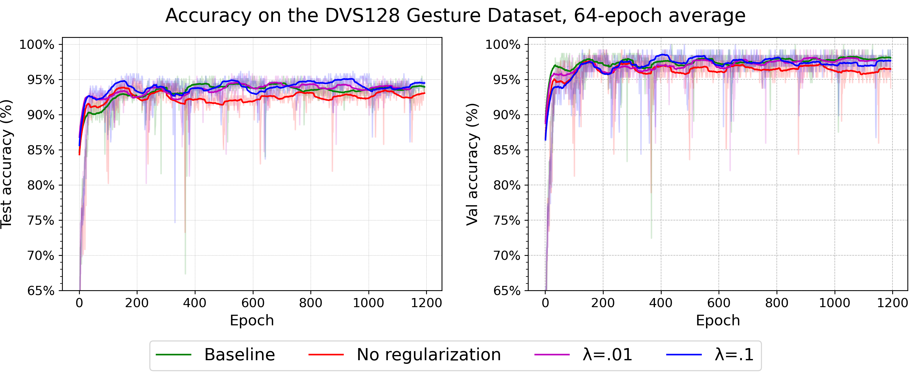

# The effect of a learnable membrane time constant per neuron on spiking neural network accuracy

This codebase extends the implementation of *[Incorporating Learnable Membrane Time Constant to Enhance Learning of Spiking Neural Networks](https://arxiv.org/abs/2007.05785)* with PLIF neuron layers where each neuron has a learnable membrane time constant.

This work is part of the [Research Project 2024](https://github.com/TU-Delft-CSE/Research-Project) at [TU Delft](https://github.com/TU-Delft-CSE).

## Accuracy

| **Model**      | **Test Accuracy** | **Val Accuracy** |
|----------------|-------------------|------------------|
| Baseline       | 95.5%             | 100%             |
| No Reg.        | 95.1%             | 99.2%            |
| $\lambda=.01$  | 95.8%             | 99.2%            |
| $\lambda=.1$   | 96.2%             | 100%             |

*Table 1: Comparison of the maximum achieved test and validation set accuracies. Each model has been trained once for 1200-1500 epochs using the seed $2020$. All the best performing instances on the test set were encountered in the first 600 epochs.*




## File Structure

`code` contains model implementations and a script to run the experiments

`models.py` implements the models

`train_val.py` is used to run the experiments

`figures` contains the figures used for result visualization as well as the script used to produce them `results.ipynb`

`checkpoints` contains the final checkpoints of the four models

## Dependencies

The original code uses an old version SpikingJelly. To maximize reproducibility, it is possible to rollback installed SpikingJelly to the version used:


```bash
git clone https://github.com/fangwei123456/spikingjelly.git
cd spikingjelly
git reset --hard 73f94ab983d0167623015537f7d4460b064cfca1
python setup.py install
```

Here is the commit information:

```bash
commit 73f94ab983d0167623015537f7d4460b064cfca1
Author: fangwei123456 <fangwei123456@pku.edu.cn>
Date:   Wed Sep 30 16:42:25 2020 +0800

    增加detach reset的选项
```

## Running the experiments
Experiments can be replicated using the following commands:

### baseline model
```
python [dir to train_val.py] -init_tau 2.0 -use_max_pool -device cuda:0 -dataset_name DVS128Gesture -log_dir_prefix [dataset_directory] -T 20 -max_epoch 1256 -detach_reset -channels 128 -number_layer 5 -split_by number -normalization None -use_plif
```

### "No regularization" model
```
python [dir to train_val.py] -init_tau 2.0 -tau_std_dev 0.1 -use_max_pool -device cuda:0 -dataset_name DVS128Gesture -log_dir_prefix [dataset_directory] -T 20 -max_epoch 1256 -detach_reset -channels 128 -number_layer 5 -split_by number -normalization None -use_plif -tau_per_neuron
```

### "lambda=0.01" model
```
python [dir to train_val.py] -init_tau 2.0 -tau_std_dev 0.1 -use_max_pool -device cuda:0 -dataset_name DVS128Gesture -log_dir_prefix [dataset_directory] -T 20 -max_epoch 1256 -detach_reset -channels 128 -number_layer 5 -split_by number -normalization None -use_plif -tau_per_neuron -reg_lambda 0.01
```

### "lambda=0.1" model
```
python [dir to train_val.py] -init_tau 2.0 -tau_std_dev 0.1 -use_max_pool -device cuda:0 -dataset_name DVS128Gesture -log_dir_prefix [dataset_directory] -T 20 -max_epoch 1256 -detach_reset -channels 128 -number_layer 5 -split_by number -normalization None -use_plif -tau_per_neuron -reg_lambda 0.1
```

Checkpoints and logs are saved to the [dataset_directory].

## DVS128 Gesture dataset
The DVS128 Gesture dataset needs to be manually downloaded from: [DVS128 Gesture dataset](https://ibm.ent.box.com/s/3hiq58ww1pbbjrinh367ykfdf60xsfm8/folder/50167556794)

The data needs to be saved to `../data/DVS128Gesture` relative to the `train_val.py` script directory.

## Arguments Definition

This table shows the definition of all arguments:

| argument        | meaning                                                      | type                                                         | default |
| --------------- | ------------------------------------------------------------ | ------------------------------------------------------------ | ------- |
| init_tau        | tau of all LIF neurons, or tau_0 of PLIF neurons, used as $\mu$ for initialization in case of tau_per_neuron=True             | float                                                        | -       |
| batch_size      | training batch size                                          | int                                                          | 16      |
| learning_rate   | learning rate                                                | float                                                        | 1e-3    |
| T_max           | period of the learning rate schedule                         | int                                                          | 64      |
| use_plif        | use PLIF neurons                                             | action='store_true'                                          | False   |
| alpha_learnable | if given, `alpha` in the surrogate function is learnable     | action='store_true'                                          | False   |
| use_max_pool    | if given, the network will use max pooling, else use average pooling | action='store_true'                                          | False   |
| device          | use which device to train                                    | str                                                          | -       |
| dataset_name    | use which dataset                                            | str(`MNIST`,`FashionMNIST`,`CIFAR10`,`NMNIST`,`CIFAR10DVS`or`DVSGesture`) | -       |
| log_dir_prefix  | the path for TensorBoard to save logs                        | str                                                          | -       |
| T               | simulating time-step                                         | int                                                          | -       |
| channels        | the out channels of Conv2d for neuromorphic datasets         | int                                                          | -       |
| number_layer    | the number of Conv2d layers for neuromorphic datasets        | int                                                          | -       |
| split_by        | how to split the events to integrate them to frames          | str(`time` or`number` )                                      | -       |
| normalization   | normalization for frames during being integrated             | str(`frequency`,`max`,`norm`,`sum` or`None`)                 | -       |
| max_epoch       | maximum training epoch                                       | int                                                          | -       |
| detach_reset    | whether detach the voltage reset during backward             | action='store_true'                                          | False   | |
tau_per_neuron    | Whether the PLIF neuron layers should assign a $\tau$ to each neuron |  | False |
tau_std_dev       | $\sigma$ used for initialization in case of tau_per_neuron=True |  | 0 |
reg_lambda        | Regularization term $\lambda$ in case of tau_per_neuron=True |  | 0 |
seed              | Seed |  | 2020 |

For more details about `split_by` and `normalization`, see:

https://spikingjelly.readthedocs.io/zh_CN/0.0.0.0.4/spikingjelly.datasets.html#integrate-events-to-frames-init-en
